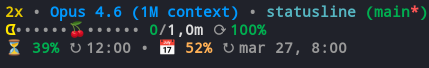

<p align="center">
  <br>
  <code>&nbsp;ᗣ · · · · ᗧ • • • • • 🍒 • • • • •&nbsp;</code>
  <br><br>
  <strong>pacman-statusline</strong>
  <br>
  <em>ᗧ chomp through your Claude Code context</em>
  <br><br>
  <a href="LICENSE"></a>
  
  
  
</p>

---

A Pac-Man themed statusline for [Claude Code](https://docs.anthropic.com/en/docs/claude-code) that turns your context window into an arcade game. Watch Pac-Man chomp through your tokens while a ghost closes in as usage climbs. Grab the cherry before it's too late.

<!-- ᗧ · · · · · · · · · · · · · · · · · · · · · · · · ● -->

## Screenshot



<!-- ᗧ · · · · · · · · · · · · · · · · · · · · · · · · ● -->

## Features

- **Pac-Man context bar** — animated progress bar where ᗧ eats through your available tokens
- **Color-coded urgency** — Pac-Man shifts from yellow to orange to red to purple as context fills up
- **Ghost chase** — ᗣ appears at 50% usage and stalks closer to Pac-Man as you approach the limit
- **Cherry power-up** — 🍒 sits in the remaining dots, a reminder of the space you have left
- **Session info** — model name, current directory, git branch (with dirty indicator), session duration
- **Rate limit tracking** — 5-hour and 7-day usage percentages with reset countdown timers
- **2x off-peak badge** — highlights when you're in the off-peak bonus window
- **Extra usage tracking** — monitors spend if extra usage credits are enabled
- **Smart OAuth** — resolves tokens from env vars, macOS Keychain, credentials file, or Linux secret-tool
- **60-second cache** — API responses are cached to keep things fast

<!-- ᗧ · · · · · · · · · · · · · · · · · · · · · · · · ● -->

## How It Works

Your Claude Code context window is **The Maze**:

| Arcade | Statusline |
|--------|-----------|
| **ᗧ Pac-Man** | Your token usage, chomping through available context |
| **ᗣ Ghost** | The approaching context limit — appears at 50% and hunts you down |
| **🍒 Cherry** | Bonus marker sitting in your remaining token space |
| **● Dots** | Available context tokens waiting to be consumed |
| **· Trail** | Already consumed tokens left behind |
| **2x Power Pellet** | Off-peak hours — you're running at double speed |

As your session progresses, Pac-Man eats through the dots. The ghost fades in at 50% and gets closer and brighter as you approach the limit. Pac-Man himself changes color to signal urgency:

- **Yellow** `ᗧ` — plenty of room (< 50%)
- **Orange** `ᗧ` — halfway there (50-69%)
- **Red** `ᗧ` — getting tight (70-89%)
- **Purple** `ᗧ` — danger zone (90%+)

<!-- ᗧ · · · · · · · · · · · · · · · · · · · · · · · · ● -->

## The Three Lines

```
2x • Claude Opus 4.6 • my-project (main) • ⌚ 23m
ᗣ · · · · · ᗧ • • 🍒 • • • • • 95k/1.0m ⟳ 52%
⏳ 34% ↻ 3:45pm • 📅 12% ↻ mar 28, 2:00pm
```

**Line 1** — Model, directory, git branch, session timer, off-peak badge

**Line 2** — The Pac-Man context bar with token counts and remaining percentage

**Line 3** — Rate limits (5-hour + 7-day windows) with reset times and extra usage spend

<!-- ᗧ · · · · · · · · · · · · · · · · · · · · · · · · ● -->

## Installation

### One-liner

```bash
curl -fsSL https://raw.githubusercontent.com/renathoaz/pacman-statusline/main/install.sh | bash
```

<details>
<summary><strong>Manual installation</strong></summary>

1. Clone the repository:
```bash
git clone https://github.com/renathoaz/pacman-statusline.git
cd pacman-statusline
```

2. Copy the script:
```bash
cp pacline.sh ~/.claude/pacline.sh
chmod +x ~/.claude/pacline.sh
```

3. Add to your Claude Code settings (`~/.claude/settings.json`):
```json
{
  "statusLine": {
    "type": "command",
    "command": "bash ~/.claude/pacline.sh"
  }
}
```

4. Restart Claude Code — Pac-Man is now eating your tokens.

</details>

<!-- ᗧ · · · · · · · · · · · · · · · · · · · · · · · · ● -->

## Configuration

Pacline works out of the box with sensible defaults. The following can be customized:

| What | How |
|------|-----|
| **OAuth token** | Set `CLAUDE_CODE_OAUTH_TOKEN` env var to skip auto-detection |
| **Cache duration** | Default 60 seconds — edit `cache_max_age` in `pacline.sh` |
| **Bar width** | Default 15 characters — edit the `build_bar` call width parameter |
| **Off-peak hours** | Default: weekends + weekdays before 8am/after 2pm ET |

<!-- ᗧ · · · · · · · · · · · · · · · · · · · · · · · · ● -->

## Requirements

- [Claude Code](https://docs.anthropic.com/en/docs/claude-code) CLI
- `jq` — JSON parsing
- `curl` — API usage fetching
- `bash` 4+
- `git` — for branch display (optional)

<!-- ᗧ · · · · · · · · · · · · · · · · · · · · · · · · ● -->

## Uninstalling

```bash
curl -fsSL https://raw.githubusercontent.com/renathoaz/pacman-statusline/main/uninstall.sh | bash
```

Or manually:
```bash
rm ~/.claude/pacline.sh
rm -f /tmp/claude/pacline-cache.json
```
Then remove the `statusLine` block from `~/.claude/settings.json`.

<!-- ᗧ · · · · · · · · · · · · · · · · · · · · · · · · ● -->

## Contributing

See [CONTRIBUTING.md](CONTRIBUTING.md) for guidelines and a sample JSON input for testing.

<!-- ᗧ · · · · · · · · · · · · · · · · · · · · · · · · ● -->

## License

[MIT](LICENSE)

---

<p align="center">
  <code>ᗣ ᗣ ᗣ ᗧ · · · · · ●</code>
  <br>
  <em>Made with waka waka by <a href="https://github.com/renathoaz">@renathoaz</a></em>
  <br>
  <sub>ᗧ chomp chomp chomp</sub>
</p>
